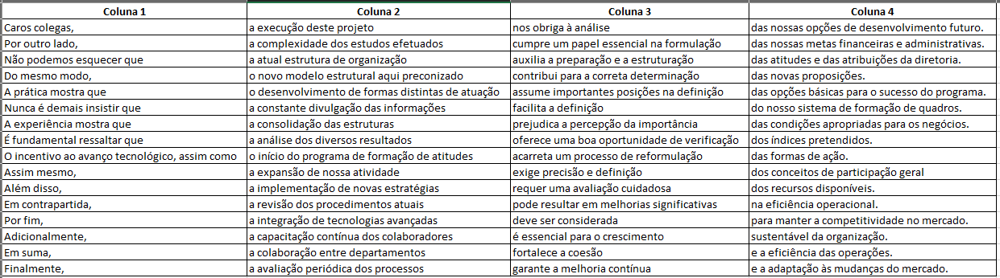

# Gerador de Frases Corporativas

Bem-vindo ao **Gerador de Frases Corporativas**! 🎉 Este projeto é a solução definitiva para criar frases que soam incrivelmente importantes, mas que na verdade não dizem absolutamente nada. Ideal para reuniões, apresentações e qualquer situação em que você precise impressionar sem se comprometer.

## Descrição

Este projeto combina aleatoriamente frases de quatro colunas para gerar sentenças completas que são gramaticalmente corretas, mas sem nenhum conteúdo significativo. Perfeito para aqueles momentos em que você precisa falar muito sem dizer nada!

## Como Funciona

O script em Python seleciona aleatoriamente uma frase de cada coluna e as combina para formar uma sentença completa. No final, você pode escolher se deseja gerar outra frase ou encerrar o programa.

## Como Usar
1. Clone este repositório.
2. Execute o script gerador_frases.py.
3. Siga as instruções na tela para gerar frases corporativas sem conteúdo.

## Contribuições
Contribuições são bem-vindas! Sinta-se à vontade para abrir issues e pull requests.

## Licença
Este projeto está licenciado sob a Licença MIT. Veja o arquivo LICENSE para mais detalhes.
